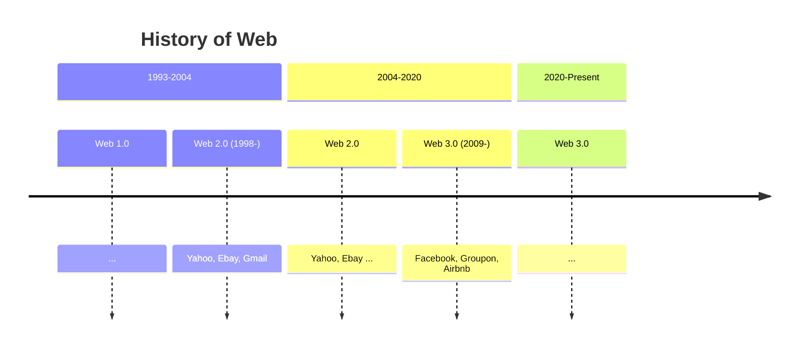

# Multiple Entries

You can split your slides.md into multiple files and organize them as you want using the `src` attribute.

#### `slides.md`

```markdown
# Page 1

Page 2 from main entry.

---
src: ./subpage.md
---
```

<br>

#### `subpage.md`

```markdown
# Page 2

Page 2 from another file.
```

[Learn more](https://sli.dev/guide/syntax.html#multiple-entries)

---

# Page Mermaid

